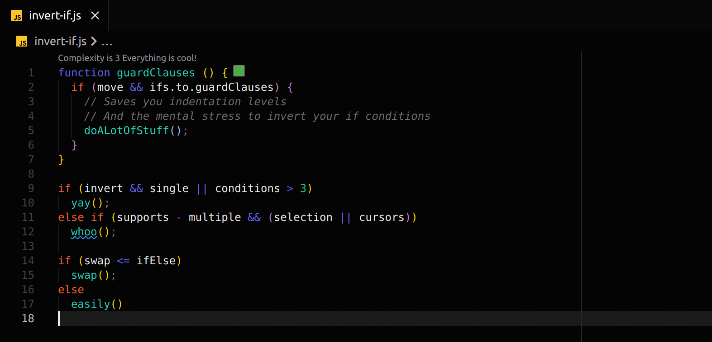

# Invert If

This is a preview for the `invert-if` Extension that allows you to quickly and easily **invert if blocks**, **invert conditions** and **create guard clauses**. 

## Features

While still in active development, the following features are already available:

### Commands

- `Invert If: Invert If Block` Inverts if / else blocks
- `Invert If: Create Guard Clause from Condition` Creates guard clause for the selected Condition
- `Invert If: Invert Condition` Invert selected edition

The selection is currently only the condition under the active cursors, but more fine grained control will be available. The commands take into account **all** cursors, so **multiple selections** are possible.

## Extension Settings

The extension settings are currently not exported

## Known Issues

There are most likely a few Bugs, but the tests are in the process of being expanded.

## Contributing

There are currently no feature contributions required, but when you encounter an error or weird behavior feel free to open an issue. I still need a lot of test data to provide solid fixtures for all edge cases.